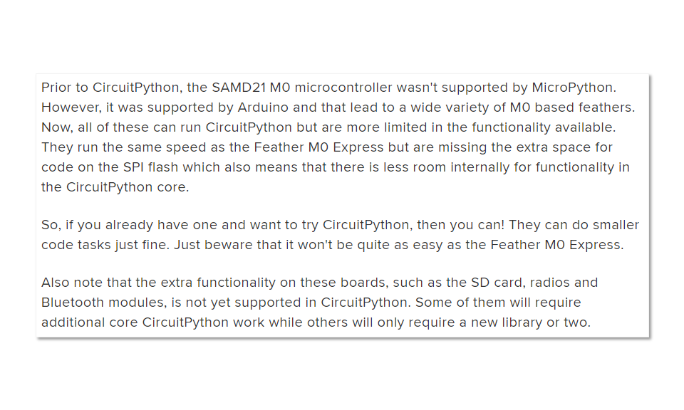

# Wio Lite W600 IoTwx ATMOS Node

This repository contains the code for running
the Wio Lite W600 microcontroller as an 
ATMOS node in an IoTwx station.  This 
implementation is based on the CircuitPython
5.0 release (January 2020), and requires
the BME280 sensor for basic temperature,
humidity, pressure and altitude measurements.

## Hardware
The ATMOS node is composed of a radiation 
shield and a connector allowing installation
on a 1" PVC pipe constructed stand for 
the instrument to be seated.

### Computer
Any computer with a modern operating system running MacOS, Windows or Linux will work for this installation.  You will need the computer to connect the microcontroller for programming the node and uploading the code that reads sensor measurements.

### Microcontroller

* [Wio Lite W600](https://www.seeedstudio.com/Wio-Lite-W600-p-4155.html) ATSAMD21/Cortex M0 micrcontroller
* [Wio Lite W600 Grove Shield](https://www.seeedstudio.com/Grove-Shield-for-Wio-Lite-p-4156.html)
* USB-C cable

### Sensor
* [SeeedStudio Grove BME280 I2C Sensor](https://www.seeedstudio.com/Grove-BME280-Environmental-Sensor-Temperature-Humidity-Barometer.html) 
* [50-100cm Grove cable](https://www.seeedstudio.com/cables-c-949.html)

### 3D-printed Stevenson Radiation Shield
You will need to purchase the filament and have a 3D-printer with at least a 7" base plate to print the standard sized radiation shield.

## Software

This node is based on the [CircuitPython 5.0.0 Beta 3](https://github.com/adafruit/circuitpython/releases/tag/5.0.0-beta.3) release, and uses the Adafruit CircuitPython [BME280 library](https://github.com/adafruit/Adafruit_CircuitPython_BME280).

## Installation, Implementation and Testing

3. Carefully install the W600 onto the Grove shield.  NOTE: Do not plug in the W600 USB-C cable at this time &mdash; the microcontroller should be unpowered at this time. 

1. Power on the W600, inserting the USB cable into your computer and install CircuitPython 5.0 according to the SAMD21 instructions [here](https://learn.adafruit.com/installing-circuitpython-on-samd21-boards?view=all).

2. Install the BME280 libraries according to the instructions [here](https://github.com/adafruit/Adafruit_CircuitPython_Bundle) for installing the CircuitPython Bundle.  This is the _fastest_, _easiest_ way to obtain the drivers.

4. Insert the Grove cable into an available I2C port and attach the BME280 onto the other end.

5. Test the sensor with the code provided in the test folder.

## Limitations and Issues
Please post any issues with the software or documentation in the [issues](https://github.com/iotwx/wiolitew600_atmos_circuitpython/issues) area of this repository.

At the time of CirctuitPython 5.0.0, Wifi capabilities are not implemented for this chip. 
[According to the CircuitPython development team](https://learn.adafruit.com/adafruit-feather/circuitpython), (as of Q1/2020) since the MicroPython libraries are not yet implemented for the full feature set of the SAMD21 M0 chipset functionalities like Wifi, BLE and others are not yet implemented in CircuitPython: 

Thus, none of the typical communications capabilities are implemented, but will be integreated when they are available.